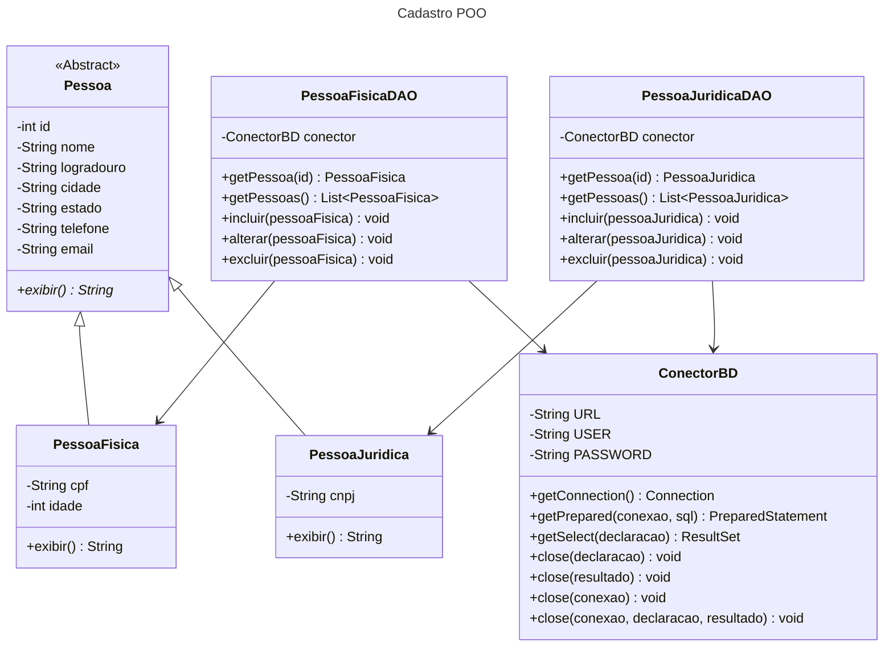

# Sistema cadastral em Java com persistência de dados utilizando o Microsoft SQL Server

- Essa missão prática foi dividida em dois procedimentos. 
- O 1ª Procedimento envolve o Mapeamento Objeto-Relacional e DAO, enquanto que o 2ª Procedimento envolve Alimentar a Base. O desenvolvimento dos procedimentos estão organizados por branch. 
- O 1ª Procedimento está na branch PrimeiroProcedimento, e o 2ª Procedimento está na branch SegundoProcedimento.
- Essa branch **PrimeiroProcedimento** se refere aos dois procedimentos.

## Objetivos da prática
1. Implementar persistência com base no middleware JDBC.
2. Utilizar o padrão DAO (Data Access Object) no manuseio de dados.
3. Implementar o mapeamento objeto-relacional em sistemas Java.
4. Criar sistemas cadastrais com persistência em banco relacional.
5. No final do exercício, o aluno terá criado um aplicativo cadastral com uso do SQL Server na persistência de dados.

## Relatório discente de acompanhamento

O relatórios dos Procedimentos podem ser encontrados através desse próprio repositório, na branch específica do procedimento, ou através do link a seguir:
  
[https://github.com/luizmarinhojr/cadastro-BD/blob/main/relatorio-discente-de-acompanhamento.pdf](https://github.com/luizmarinhojr/cadastro-BD/blob/main/relatorio-discente-de-acompanhamento.pdf)
  

## Tecnologias utilizadas

## Diagrama de classes

 
 
